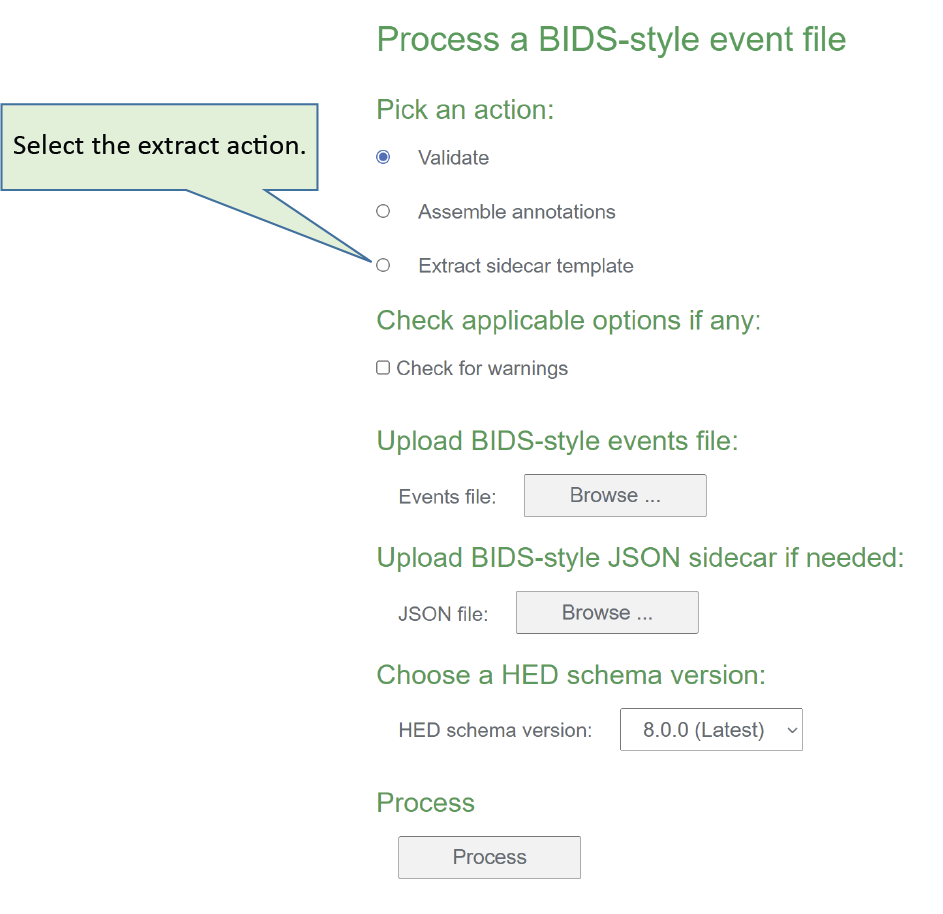
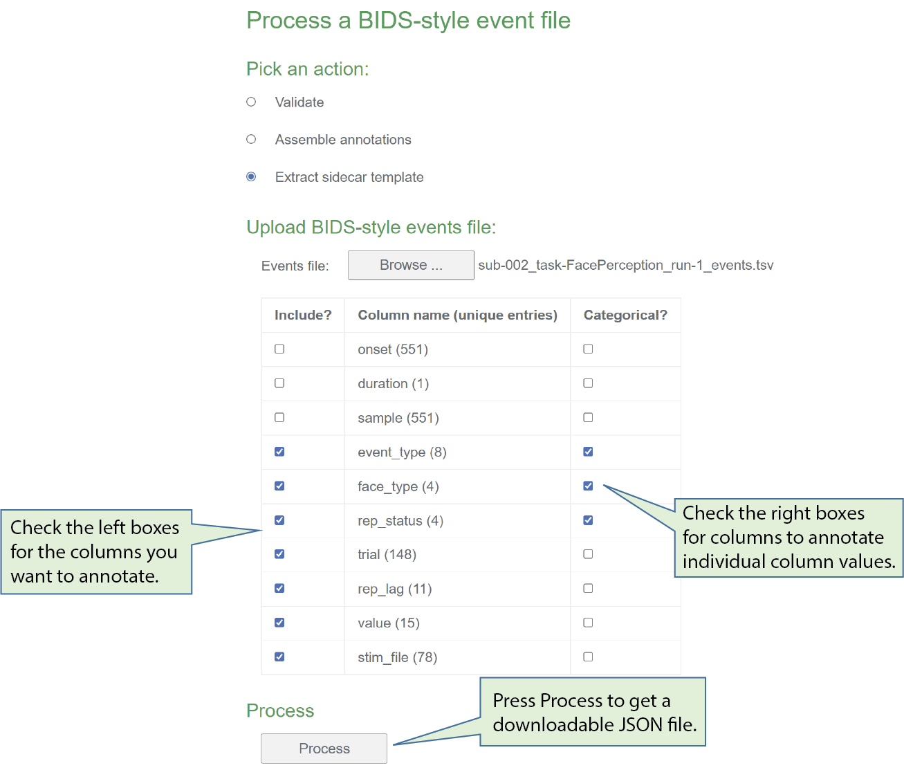

# Event annotation quickstart

**Note: This tutorial is in the process of being developed.** 

This tutorial provides a step-by-step guide to creating a JSON sidecar
template file from one of your BIDS `events.tsv` files using the online
tools available at [**hedtools.ucsd.edu/hed**](https://hedtools.ucsd.edu/hed).
You can then edit this JSON file directly using a text editor
to put in descriptions and HED annotations of your events.

## Extract a sidecar from an events file.
The goal is to construct a single `events.json` sidecar file located in 
the root directory of your dataset with all the annotations needed for
users to understand and analyze your data.

The basic process using the online tools is:  

* [Step 1: Upload your .events.tsv file.](#step-1-upload-an-events-file)  
* [Step 2: Select event file columns to be annotated.](#step-2-select-event-columns)  
* [Step 3: Create and download the template.](#step-3-download-template) 
* [Step 4: Enter the annotations.](#step-4-edit-annotations) 
* [Step 5: Upload the annotations to dataset.](#step-5-save-sidecar) 

This tutorial creates a sidecar template from the information in one of your dataset event files.
Working from a template is much easier and faster than creating a sidecar from scratch.

This tutorial focuses on the mechanics of event annotation, particularly
for [**BIDS Brain Imaging Data Structure**](https://bids-specification.readthedocs.io/en/stable/) datasets.
We are using an
[**abbreviated version**](./tutorial_data/sub-002_task-FacePerception_run-1_events.tsv) of
the `events.tsv`file from subject 002 run 1 from
[**openNeuro.org**](https://openneuro.org) dataset ds003654s to illustrate the process.

### Step 1: Upload an events file.
Go to the [**Events**](https://hedtools.ucsd.edu/hed/events) page of the HED online tools.
You will see the following menu:

Select the **Extract sidecar template** action and upload your `events.tsv` file
using the **Browse** button.

### Step 2: Select event columns.
When the file has been uploaded, the form will expand to show the
columns available for inclusion in your annotation template: 

The checkboxes on the left indicate which event file columns should be 
included in the JSON sidecar annotation template. 

The checkboxes on the right indicate which event file columns contain values that
you wish to annotate individually.
We refer to these columns as the categorical columns.

The following shows the result of selecting the `event_type`, `face_type`,
`rep_status`, `trial`, `rep_lag`, `value`, and `stim_file` columns for annotation:

Notice that we have designated only the `event_type`, `face_type`, and `rep_status`
to have the individual column values annotations (right checkboxes).
Conveniently, the menu shows the number of unique values that appear in each
column. This information can be a useful in making your selection.

Usually we don't include the standard `onset`, `duration`, and `sample` columns
in the annotation, so their left checkboxes are not selected.
The 551 unique values in the `onset` column corresponds roughly
(since there may be multiple events with the same onset time) to the
number of events. 

All the values in the `duration` are `n/a` for this particular `events.tsv` file, 
so the `duration` column only contains one unique value.

The `event_type`, `face_type`, and `rep_status` have a total of 16 unique values,
which we have elected to annotate individually.

In addition, we have elected to annotate `trial`, `rep_lag`, `value`, and `stim_file`
by describing these columns as a whole, resulting in 4 additional annotations.

### Step 3: Download template.

Press the **Process** button and save the resulting
[**JSON sidecar template**](./tutorial_data/sub-002_task-FacePerception_run-1_events_extracted.json) as a file.

### Step 4: Edit the annotations.

Here is the result of 

### Step 5: Save the sidear

### Other comments

Alternatively you can convert the JSON file to a spreadsheet for easier editing
and then convert back afterwards.
See [Easy HED editing](EasierHEDEditing.md) for a walk-through of this process.
Finally, there is a standalone GUI tool called CTagger,
which provides user-friendly assistance.
See [HED tagging with CTagger](HEDTaggingWithCTagger.md) for a step-by-step guide.

Note that annotation is usually an iterative process.
Once you have done the initial annotation, you can improve it by
by editing the sidecar.

See [Basic HED annotation guide](BasicHEDAnnotation.md) for a
walk-through of how select your HED annotations.

See the [CTagger Annotation Guide](HEDTaggingWithCTagger.md) for
instructions on how to select HED tags for your template using a user-friendly
GUI.